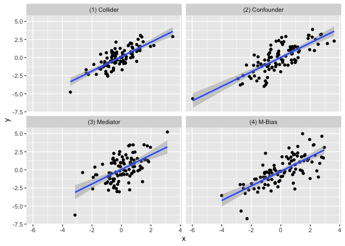
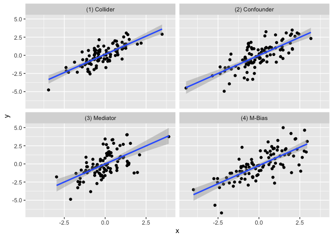
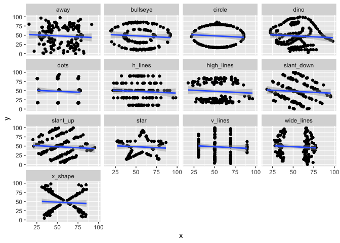
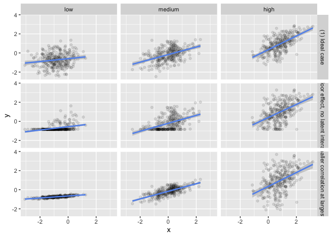

<!-- README.md is generated from README.Rmd. Please edit that file -->

# quartet

<!-- badges: start -->
<!-- badges: end -->

The quartet package is a collection of datasets aimed to help data
analysis practitioners and students learn key statistical insights in a
hands-on manner. It contains:

- Anscombe’s Quartet
- Causal Quartet
- Datasaurus Dozen
- Interaction Triptych

## Installation

You can install the development version of quartet like so:

``` r
devtools::install_github("LucyMcGowan/quartet")
```

## Anscombe’s Quartet

The goal of the `anscombe_quartet` data set is to help drive home the
point that visualizing your data is important. Francis Anscombe
generated these four datasets to demonstrate that statistical summary
measures alone cannot capture the full relationship between two
variables (here, `x` and `y`). Anscombe emphasized the importance of
visualizing data prior to calculating summary statistics.

- Dataset 1 has a linear relationship between `x` and `y`
- Dataset 2 has shows a nonlinear relationship between `x` and `y`
- Dataset 3 has a linear relationship between `x` and `y` with a single
  outlier
- Dataset 4 has shows no relationship between `x` and `y` with a single
  outlier that serves as a high-leverage point.

In each of the datasets the following statistical summaries hold: \*
mean of `x`: 9 \* variance of `x`: 11 \* mean of `y`: 7.5 \* variance of
y: 4.125 \* correlation between `x` and `y`: 0.816 \* linear regression
between `x` and `y`: `y = 3 + 0.5x` \* $R^2$ for the regression: 0.67

## Example

``` r
library(tidyverse)
library(quartet)

ggplot(anscombe_quartet, aes(x = x, y = y)) +
  geom_point() + 
  geom_smooth(method = "lm", formula = "y ~ x") +
  facet_wrap(~dataset)
```



``` r

anscombe_quartet |>
  group_by(dataset) |>
  summarise(mean_x = mean(x),
            var_x = var(x),
            mean_y = mean(y),
            var_y = var(y),
            cor = cor(x, y)) |>
  knitr::kable(digits = 2)
```

| dataset         | mean_x | var_x | mean_y | var_y |  cor |
|:----------------|-------:|------:|-------:|------:|-----:|
| \(1\) Linear    |      9 |    11 |    7.5 |  4.13 | 0.82 |
| \(2\) Nonlinear |      9 |    11 |    7.5 |  4.13 | 0.82 |
| \(3\) Outlier   |      9 |    11 |    7.5 |  4.12 | 0.82 |
| \(4\) Leverage  |      9 |    11 |    7.5 |  4.12 | 0.82 |

## Causal Quartet

The goal of the `causal_quartet` data set is to help drive home the
point that when presented with an exposure, outcome, and some measured
factors, statistics alone, whether summary statistics or data
visualizations, are not sufficient to determine the appropriate causal
estimate. Additional information about the data generating mechanism is
needed in order to draw the correct conclusions. See [this
paper](https://github.com/LucyMcGowan/writing-quartet/blob/main/manuscript.pdf)
for details.

## Example

``` r
ggplot(causal_quartet, aes(x = x, y = y)) +
  geom_point() + 
  geom_smooth(method = "lm", formula = "y ~ x") +
  facet_wrap(~dataset)
```



``` r
causal_quartet |>
  nest_by(dataset) |>
  mutate(`Y ~ X` = round(coef(lm(y ~ x, data = data))[2], 2),
         `Y ~ X + Z` = round(coef(lm(y ~ x + z, data = data))[2], 2),
         `Correlation of X and Z` = round(cor(data$x, data$z), 2)) |>
  select(-data, `Data generating mechanism` = dataset) |>
  knitr::kable()
```

| Data generating mechanism | Y \~ X | Y \~ X + Z | Correlation of X and Z |
|:--------------------------|-------:|-----------:|-----------------------:|
| \(1\) Collider            |      1 |       0.55 |                    0.7 |
| \(2\) Confounder          |      1 |       0.50 |                    0.7 |
| \(3\) Mediator            |      1 |       0.00 |                    0.7 |
| \(4\) M-Bias              |      1 |       0.88 |                    0.7 |

## Datasaurus Dozen

Similar to Anscombe’s Quartet, the Datasaurus Dozen has additional data
sets where the mean, variance, and Pearson’s correlation are identical,
but visualizations demonstrate the large difference between datasets.
This dataset is rexported from the
[datasauRus](https://CRAN.R-project.org/package=datasauRus) R package.

## Example

``` r
ggplot(datasaurus_dozen, aes(x = x, y = y)) +
  geom_point() + 
  geom_smooth(method = "lm", formula = "y ~ x") +
  facet_wrap(~dataset)
```



``` r

datasaurus_dozen |>
  group_by(dataset) |>
  summarise(mean_x = mean(x),
            var_x = var(x),
            mean_y = mean(y),
            var_y = var(y),
            cor = cor(x, y)) |>
  knitr::kable(digits = 2)
```

| dataset    | mean_x |  var_x | mean_y |  var_y |   cor |
|:-----------|-------:|-------:|-------:|-------:|------:|
| away       |  54.27 | 281.23 |  47.83 | 725.75 | -0.06 |
| bullseye   |  54.27 | 281.21 |  47.83 | 725.53 | -0.07 |
| circle     |  54.27 | 280.90 |  47.84 | 725.23 | -0.07 |
| dino       |  54.26 | 281.07 |  47.83 | 725.52 | -0.06 |
| dots       |  54.26 | 281.16 |  47.84 | 725.24 | -0.06 |
| h_lines    |  54.26 | 281.10 |  47.83 | 725.76 | -0.06 |
| high_lines |  54.27 | 281.12 |  47.84 | 725.76 | -0.07 |
| slant_down |  54.27 | 281.12 |  47.84 | 725.55 | -0.07 |
| slant_up   |  54.27 | 281.19 |  47.83 | 725.69 | -0.07 |
| star       |  54.27 | 281.20 |  47.84 | 725.24 | -0.06 |
| v_lines    |  54.27 | 281.23 |  47.84 | 725.64 | -0.07 |
| wide_lines |  54.27 | 281.23 |  47.83 | 725.65 | -0.07 |
| x_shape    |  54.26 | 281.23 |  47.84 | 725.22 | -0.07 |

## Interaction Triptych

This set of 3 datasets demonstrating that while the slopes estimated by
a simple linear interaction model may be the same, the underlying
data-generating mechanisms can be vastly different.

``` r
ggplot(interaction_triptych, aes(x, y)) +
  geom_point(alpha = 0.1) +
  geom_smooth(method = "lm", formula = "y ~ x", color = "cornflower blue") + 
  facet_grid(dataset ~ moderator)
```



## References

Anscombe, F. J. (1973). “Graphs in Statistical Analysis”. American
Statistician. 27 (1): 17–21. <doi:10.1080/00031305.1973.10478966>. JSTOR
2682899.

Davies R, Locke S, D’Agostino McGowan L (2022). *datasauRus: Datasets
from the Datasaurus Dozen*. R package version 0.1.6,
<https://CRAN.R-project.org/package=datasauRus>.

Matejka, J., & Fitzmaurice, G. (2017). Same Stats, Different Graphs:
Generating Datasets with Varied Appearance and Identical Statistics
through Simulated Annealing. CHI 2017 Conference proceedings: ACM SIGCHI
Conference on Human Factors in Computing Systems. Retrieved from
<https://www.autodesk.com/research/publications/same-stats-different-graphs>

Rohrer, Julia M., and Ruben C. Arslan. “Precise answers to vague
questions: Issues with interactions.” Advances in Methods and Practices
in Psychological Science 4.2 (2021): 25152459211007368.
